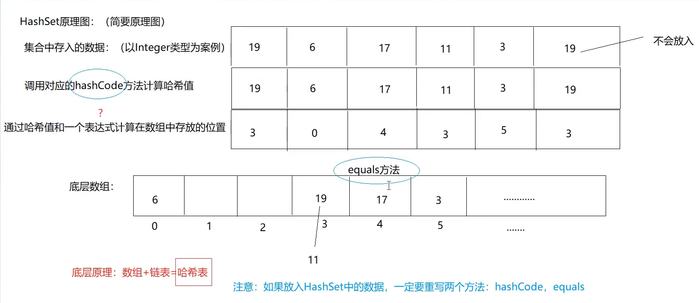

## 11.集合

### 11.1 collection接口


#### 11.1.1 List接口

##### a.LinkedList实现类的使用


##### b. 面试：iterator( ), Iterator( ),Iterable关系

[1] 对应关系


[2] hasNext(),next()具体实现


#### 11.1.2 Set接口

##### a.HashSet实现类的使用

[1] 可以放入Integer
[2] 可以放入String
[3] ==自定义数据类型不满足唯一无序==
[4] HashSet原理图



[5] 疑问：

1. 数组长度
2. 数组的类型
3. hashCode、equals方法真的调用了吗
4. 底层的表达式是什么
5. 同一个位置的数据是向前放还是向后放
6. 放入数组中的数据，是直接放吗？是否封装为对象了？

[6] LinkedHashSet

##### b.比较器的使用

##### c. TreeSet实现类的使用


### 11.2 Map接口

#### 11.2.1 常用方法

#### 11.2.2 TreeMap


#### 11.2.3 Map部分整体结构图


#### 11.2.4 源码部分

##### a. HashMap


==经典面试题：==

（1）装填因子，负载因子，加载因子 为什么是0.75：

* 装填因子设置为1：空间利用率得到了很大的满足，很容易碰撞，产生链表 ---> 查询效率低
* 装填因子设置为0.5：碰撞的概率低，扩容，产生链表的几率低，查询效率高，空间利用率太低
* 0.5-1 去中间值 0.75

（2）主数组的长度为什么是2^n:

* 原因1： h & (length-1) 等效 h% length操作，等效的前提就是：length必须是2的整数倍
* 原因2：防止哈希冲突 位置冲突
* 验证：
  length: 8
  |--------------------|
    hash: 3		00000011
    length-1: 7 00000111
    		   00000011 ----> 3位置
  |--------------------|
  hash: 2		00000010
    length-1: 7 00000111
    		   00000010 ----> 2位置
* 验证不是8的整数倍：
  length: 9
  |--------------------|
    hash: 3		00000011
    length-1: 8 00001000
    		   00000000 ----> 0位置
  |--------------------|
  hash: 2		00000010
    length-1: 9 00001000
    		   00000000 ----> 0位置

##### b.TreeMap

### 11.11 泛型

#### 11.11.1 引入

【1】什么是泛型（Generic）
泛型就相当于是标签
形式<>
集合容器类在设计阶段/声明阶段不能确定这个容器到底是实际存的是什么类型的对象，所以在JDK1.5之前只能把元素设计为Object，因此此时把元素的类型设计为一个参数，这个类型参数叫做泛型。
collection<E>、list<E>、ArrayList<E> 这个<E>就是类型参数，即泛型

【2】没有泛型的时候使用集合：
如果不适应泛型的话，优缺点：
一般我们在使用的时候基本上往集合中存入的都是相同类型的数据 --> 便于管理，所以现在什么引用类型数据都可以存入集合，不方便

【3】JDK1.5以后开始使用泛型

【4】泛型总结：
（1）JDK1.5之后
（2）泛型实际就是 一个<>引起来参数类型，这个参数类型 具体在使用的时候才会确定具体的类型

```java
public class ArrayList<E> extends AbstractList<E>
        implements List<E>, RandomAccess, Cloneable, java.io.Serializable

public interface List<E> extends Collection<E> 
```

（3）使用了泛型以后，可以确定集合中存放数据的类型，在编译时期就可以检查出来
（4）泛型遍历起来更简便
（5）泛型的类型：都是引用类型，不能是基本数据类型

#### 11.11.2  自定义泛型结构

##### a、泛型类 泛型接口

【1】 泛型类的定义和实例化

```java
public class GenericTest<E> {
    int age;
    String name;
    E sex;
    
    public void a(E n){ }
	public void b(E[ ] m){ }
}


class Test{
    public static void main(String[] args) {
        // GenericTest进行实例化
        // 1.实例化不指定泛型，那么认为此泛型为Object类型
        GenericTest gt1 = new GenericTest();
        gt1.a("abc");
        gt1.a(9.8);
        gt1.b(new String[]{"a","b","c"});

        // 2.实例化指定泛型
        GenericTest<String> gt2 = new GenericTest<>();
        gt2.sex = "male";
        gt2.a("abc");
        gt2.b(new String[]{"a","b","c"});
    }
}
```

【2】继承情况 
（1）父类指定泛型

```java
class SubGenericTest extends GenericTest<Integer>{ }

class Demo{
    public static void main(String[] args) {
        // 指定父类泛型，那么子类就不需要再指定泛型了，可以直接使用
        SubGenericTest sgt = new SubGenericTest();
        sgt.a(2);
    }
}
```

（2）父类不指定泛型
如果父类不指定泛型，那么子类也会变成一个泛型类

```java
// 如果父类不指定泛型，那么子类也会变成一个泛型类，那这个E的类型可以再创建子类对象的时候确定
class SubGenericTest2<E> extends GenericTest<E>{ }

class Demo2{
    public static void main(String[] args) {
        final SubGenericTest2<String> s = new SubGenericTest2<String>();
        s.a("abc");
        s.sex = "female";
    }
}
```

【3】引用场合：

```java
public class ArrayList<E> extends AbstractList<E>
        implements List<E>, RandomAccess, Cloneable, java.io.Serializable
```

【4】细节：
（1）泛型类可以定义多个参数

```java
public class TestGeneric<A,B,C> {
    A age;
    B name;
    C sex;

    public void a(A m,B n,C x) {

    }
```

（2）泛型类的构造器写法

```java
public TestGeneric<A,B,C>() { } // 错误
public TestGeneric() { } // 正确
```

（3）不同泛型引用类型不可以相互赋值

```java
public void b() {
    ArrayList<String> list1 = null;
    ArrayList<Integer> list2 = null;
    // .不同泛型不能赋值
    list1 == list2;
```

（4）泛型如果不指定，那么就会被擦除，反应对应的类型为Object

（5）泛型类中的静态方法 不能使用

```java
public static int c(A a){
	return 10;
}
```

（6）不能使用E[ ]创建

```java
public void a(A m,B n,C x) {
        A[ ] i = new A[10]; // 不可以：
        A[ ] i = (A[ ]) new Object[10];
    }
```

##### b、泛型方法

```java
public class TestGeneric2<E> {
    // 不是泛型方法（不能是静态方法）
    public void a(E e){}

    // 泛型方法
    public <T> void b(T t){ }

    // 可以设置静态泛型方法
    public static <T> void c(T t){ }
}

class Demo3{
    public static void main(String[] args) {
        final TestGeneric2<String> tg = new TestGeneric2<String>();
        tg.a("abc");
        tg.b("abc");
        tg.b(2);
        tg.b(true);
    }
}
```

##### c、函数参数存在继承关系的情况：

```java
public class Test {
    public static void main(String[] args) {
        Object obj = new Object();
        String s = new String();
        obj = s;

        Object[] objArr = new Object[10];
        String[] strArr = new String[10];
        objArr = strArr; // 多态

        List<Object> list1 = new ArrayList<>();
        List<String> list2 = new ArrayList<>();
        // list1 = list2;

        // 总结：A和B是子类父类关系，但G<A> G<B>不存在继承关系。是并列关系
    }
}
```

##### d、通配符

【1】在没有通配符的时候：
下面a方法相当于方法的重复定义，报错

```java
public void a(List<Object> list) { }
public void a(List<String> list) { }
public void a(List<Integer> list) { }
```

【2】引入通配符：

```java
class Demo{
    public static void main(String[] args) {
        List<Object> list1 = new ArrayList<>();
        List<String> list2 = new ArrayList<>();
        List<Integer> list3 = new ArrayList<>();

        List<?> list = null;
        list = list1;
        list = list2;
        list = list3;
    }
}
```

发现：A和B子类父类的关系 G<A>和G<B>不存在子类父类关系，是并列的
加入通配符后 G<?> 就成了G<A> G<B>的父类
【3】使用通配符

```java
public class Test {
    // 使用通配符
    public void a(List<?> list) {
        for (Object o : list) {
            System.out.println(o);
        }
    }
}
class Demo{
    public static void main(String[] args) {
        Test t = new Test();
        t.a(new ArrayList<Integer>());
        t.a(new ArrayList<String>());
        t.a(new ArrayList<Object>());
    }
}
```

【4】查看API中应用方法

##### e、使用通配符后的细节

```java
public class Test {
    // 使用通配符
    public void a(List<?> list) {
        // 1.遍历：
        for (Object o : list) {
            System.out.println(o);
        }

        // 2。数据的写入操作：
        // list.add("abc")  ---> 出错，不能随意添加数据
        list.add(null);

        // 3.数据的读取操作：
        Object s = list.get(0);
    }
}
```

##### f、泛型受限

```java
public class Test {
    public static void main(String[] args) {
        // a b c是并列关系
        List<Object> a = new ArrayList<>();
        List<Person> b = new ArrayList<>();
        List<Student> c = new ArrayList<>();
        /*
        开始使用泛型受限：泛型的上限
        List<? extends Person>
        就相当于：
        List<? extends Person>是List<Person>的父类 是List<Person子类>的父类
        */
        List<? extends Person> list1 = null;
        /*list1 = a; 出错
        list1 = b;
        list1 = c;*/

        /*
        开始使用泛型受限：泛型的下限
        List<? super Person>
        就相当于：
        List<? super Person>是List<Person>的父类 是List<Person父类>的父类
        */
        List<? super Person> list2 = null;
        /*list2 = a;
        list2 = b;
        list2 = c; 出错*/
    }
}
```

