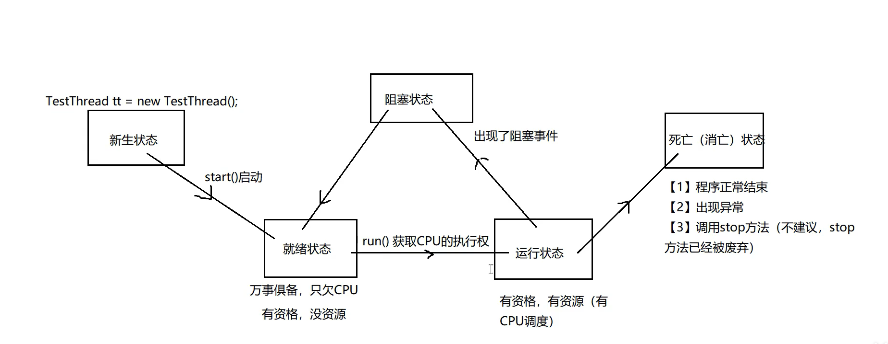
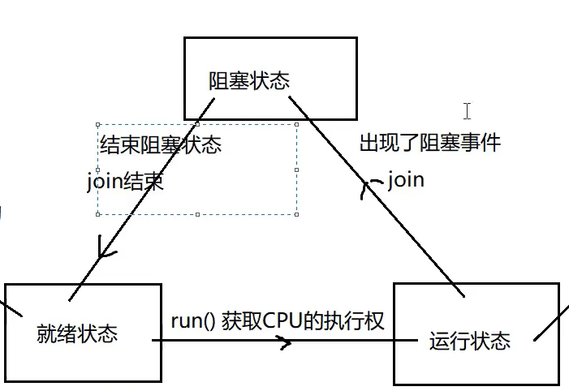
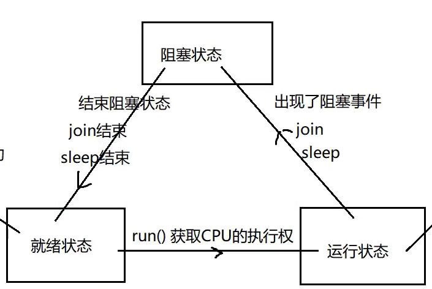
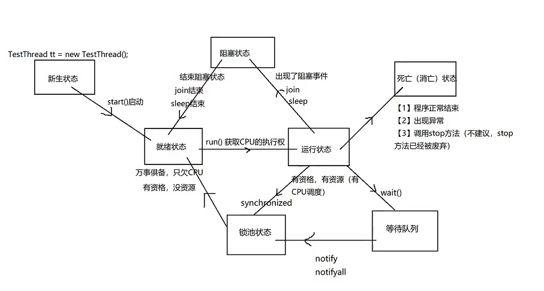
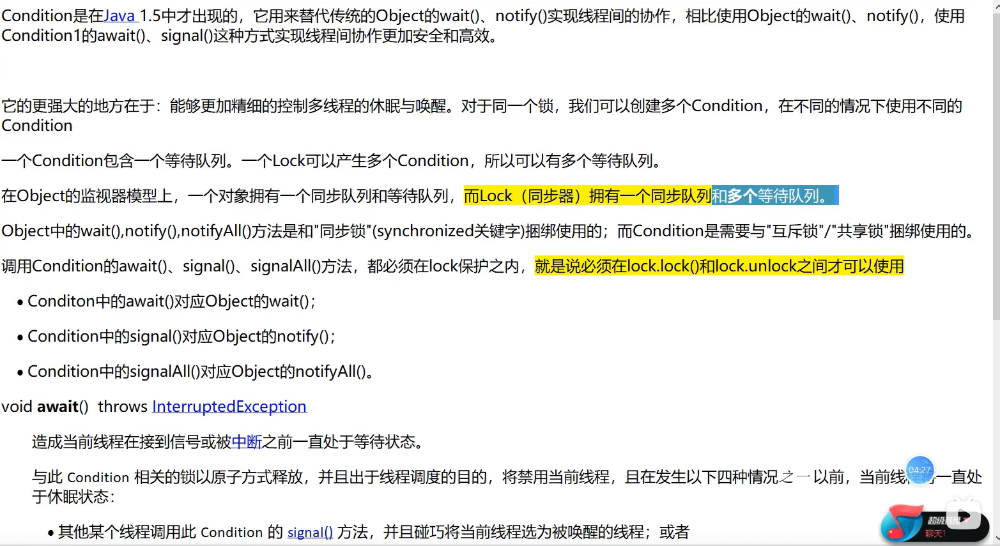

## 13.多线程

### 13.1 程序，进程，线程

### 13.2 创建线程的三种方式

#### 13.2.1 第一种：继承Thread类

#### 13.2.2 第二种：实现Runnable接口

#### 13.2.3 第三种：实现Callable接口

### 13.3 线程的生命周期



### 13.4 线程的常用方法

1. start(): 启动当前线程，表面上调用start方法，实际在调用线程里面的run方法
2. run()：线程类 继承Thread类 或者实现Runnable接口的时候，都要重新实行按这个run方法，run方法里面是线程要执行的内容
3. setName 设置名字
4. getName 读取线程名字

#### 13.4.1 设置优先级

[1] 同优先级线程，采用的策略就是先到先得服务，使用时间片策略

如果优先级别高，被CPU调度的概率高

级别：1-10 默认为5

```java
/**
  * The minimum priority that a thread can have.
  */
 public final static int MIN_PRIORITY = 1;

/**
  * The default priority that is assigned to a thread.
  */
 public final static int NORM_PRIORITY = 5;

 /**
  * The maximum priority that a thread can have.
  */
 public final static int MAX_PRIORITY = 10;
```

#### 13.4.2 join



#### 13.4.3 sleep



#### 13.4.4 setDaemon

将子线程设置为主线程的伴随线程，主线程停止的时候，子线程也不要执行了 

#### 13.4.5 stop

### 13.5 线程安全问题

#### 13.5.1 同步代码块

[3] 同步监视器总结：

总结1：认识同步监视器（锁子） ------  synchronized(同步监视器){ }

1.  必须是引用数据类型，不能是基本数据类型
2.  也可以创建一个专门的同步监视器，没有任何业务含义
3.  一般使用共享资源做同步监视器即可
4.  在同步代码块中不能改变同步监视器对象的引用

```java
final String a = "abc";
static Object o = new Object();
static int ticketNum = 10;
@Override
public void run() {
    // 每个窗口都是一个线程对象：每个对象执行代码放入run方法
    for (int i = 0; i < 100; i++) {
        synchronized (BuyTicketThread.class) { // 锁必须多线程用的同一把锁！！！
            // a = "def";
        }
    }
}
```

5. 尽量不用使用String和包装类Integer
6. 建议使用final修饰同步监视器

总结2：同步代码块的执行过程

总结3：

#### 13.5.2 同步方法：

【1】代码展示

```java
public class BuyTicketThread implements Runnable{
    int ticketNum = 10;
    @Override
    public void run() {
        for (int i = 0; i < 100; i++) {
            buyTicket();
        }
    }

    public synchronized void buyTicket() { // 锁住的是this
        if (ticketNum > 0) { // 对票数判断 票数大于零 我们才抢票
            System.out.println("我在"+Thread.currentThread().getName()+"买到了第" + ticketNum-- + "张车票");
        }
    }
}
```

---

```java
public class BuyTicketThread extends Thread {
    public BuyTicketThread(String name){
        super(name);
    }
    // 一共10张票:
    final String a = "abc";
    static Object o = new Object();
    static int ticketNum = 10;
    @Override
    public void run() {
        // 每个窗口都是一个线程对象：每个对象执行代码放入run方法
        for (int i = 0; i < 100; i++) {
            buyTicket();
        }
    }

    public static synchronized void buyTicket() {
        if (ticketNum > 0) { // 对票数判断 票数大于零 我们才抢票
            System.out.println("我在"+Thread.currentThread().getName()+"买到了第" + ticketNum-- + "张车票");
        }
    }
}
```

【2】
总结1：
多线程在争抢资源，就要实现线程的同步（就要进行加锁，并且这个锁必须是共享的，必须是唯一的）

目的：解决了线程安全

总结2：关于同步方法
    1. 不要将run()方法 定义为同步方法
    2. 非静态同步方法的同步监视器是this
       静态同步方法的同步监视器是 类名.class 字节码信息对象
    3. 同步代码块的效率要高于同步方法
       原因：同步方法是将线程挡在了方法的外部，而同步代码块锁将线程挡在了代码块的外部，但却是方法的内部
    4. 同步方法所的是this：一旦锁住一的方法，就锁住了所有的同步方法；同步代码块只是锁住使用该同步监视器的代码块，而没有锁住使用其他监视器的代码块	


#### 13.5.3 Lock锁

【1】Lock锁的引入：
JDK1.5之后新增新一代的线程同步方法：Lock锁
与采用synchronized相比，lock可提供多种锁方案，更灵活

synchronized是Java中的关键字，这个关键字的识别是靠JVM来识别完成的，是虚拟机级别。
但是Lock锁是API级别，提供了相应的接口和对应的实现类，这个方式更灵活，表现出来的性能由于之前的方式。

【2】代码演示

```java
public class BuyTicketThread2 implements Runnable{
    int ticketNum = 10;
    Lock lock = new ReentrantLock(); // 多态 接口=实现类 可以使用不同实现类
    @Override
    public void run() {
        for (int i = 0; i < 100; i++) {
            // 打开锁
            try {
                lock.lock();
                if (ticketNum > 0) {
                    System.out.println("我在" + Thread.currentThread().getName() + "买到了第" + ticketNum-- + "张车票");
                }
            } catch (Exception e) {
                e.printStackTrace();
            }finally {
                // 关闭锁 ----> 即使有异常，这个锁也可以得到释放
                lock.unlock();
            }
        }
    }
}
```

【3】Lock与synchronized区别：
	1. Lock是显示锁（手动开始和关闭锁，别忘记关锁），synchronized是隐式锁
	2. Lock只有代码块锁，synchronized有代码块锁和方法锁
	3. 使用lock锁，JVM将花费较少的时间来调度线程，性能更好。并且具有更好的扩展性（提供更多子类）

【4】优先使用顺序：
==Lock  > 同步代码块（已经进入了方法体，分配了相应的资源）>  同步方法（在方法体除外）==

#### 13.5.4 线程同步的优缺点

【1】对比：
线程安全，效率低
线程不安全，效率高

【2】可能造成死锁：
死锁

> 不同的线程分别占用对方需要的同步资源不放弃，都在等待对方放弃自己需要的同步资源，就形成了线程的死锁 
> 出现死锁后，不会出现异常，不会出现提示，只是所有的线程都处于阻塞状态，无法继续

【3】代码演示：

```java
public class TestDeadLock implements Runnable {
    public int flag = 1;
    static Object o1 = new Object(), o2 = new Object();

    @Override
    public void run() {
        System.out.println("flag=" + flag);
        // 当flag == 1锁住o1
        if (flag == 1) {
            synchronized (o1) {
                try {
                    Thread.sleep(500);
                } catch (InterruptedException e) {
                    e.printStackTrace();
                }
                // 只要锁住o2 就完成
                synchronized (o2) {
                    System.out.println("2");
                }
            }
        }
        // 当flag == 0锁住o2
        if (flag == 0) {
            synchronized (o2) {
                try {
                    Thread.sleep(500);
                } catch (InterruptedException e) {
                    e.printStackTrace();
                }
                // 只要锁住o1就完成
                synchronized (o1) {
                    System.out.println("2");
                }
            }
        }
    }

    public static void main(String[] args) {
        TestDeadLock td1 = new TestDeadLock();
        TestDeadLock td2 = new TestDeadLock();
        new Thread(td1).start();
        new Thread(td2).start();
    }
}
```

【4】解决方法：
减少同步资源定义，避免嵌套同步

```java
if (flag == 1) {
	synchronized (o1) {
    	try {
    		Thread.sleep(500);
    	} catch (InterruptedException e) {
    		e.printStackTrace();
    	}
    }
    // 只要锁住o2 就完成
    synchronized (o2) {
    	System.out.println("2");
    }
 }
```

### 13.6 线程通信问题

应用场景：生产者和消费者问题

* 假设仓库中只能存放一件产品，生产者将生产出的商品放入仓库，消费者将仓库中的产品取走消费
* 如果仓库中没有产品，则生产者将产品放入仓库，否则停止生产并等待，直到仓库中的产品被消费者取走为止
* 如果仓库中放有产品，则消费者可以将产品取走消费，否则停止消费并等待，直到仓库中再次放入产品为止

#### 13.6.1 分解1

出现问题：
打印数据错乱： 哈尔滨 null 费列罗啤酒 哈尔滨巧克力 ---- 没有加同步

#### 13.6.2 分解2 

#### 13.6.3 分解3

【3】原理


注意：wait和notify方法，是必须放在同步方法或者同步代码块中才生效（因为在同步的基础上进行线程的通信才是有效的）
注意：sleep和wait方法区别：sleep进入阻塞状态没有释放锁，wait进入阻塞状态释放锁

【4】线程生命周期完整图



#### 13.6.4 Lock锁情况下的线程通信




