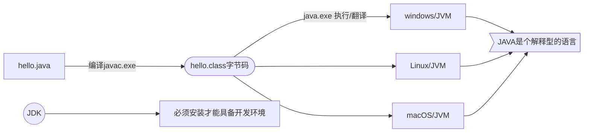
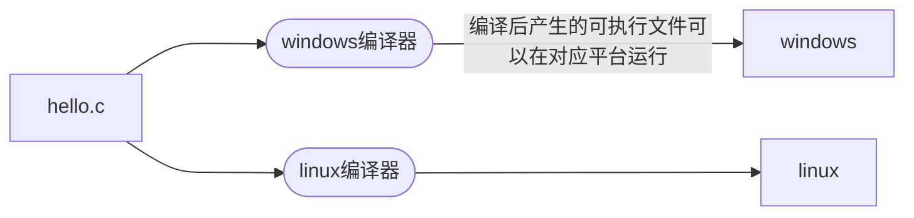

## 1. 初始JAVA

### 1.1 核心机制

#### 1.1.1 垃圾回收机制

* 不再使用的内存空间回收 ---- 垃圾收集
* java
* GC的自动回收，提高了内存空间的利用效率，也提高了编程人员的效率，很大程度上减少了因为·没有释放空间而导致的内存泄漏
* 垃圾收集在Java运行程序过程中自动进行，程序员无法精确控制和干预

后续：

1.垃圾收集器有几种
2.底层原理
3.垃圾收集器算法，优化

#### 1.1.2  跨平台原理

虚拟机充当了翻译官的作用 将字节码翻译成当前平台认识的可执行文件格式

在执行的时候，表面上我们调用的是java.exe 实际上你在调用java.exe的时候会动态调用JVM
实际真正起作用的还是JVM，JVM将字节码一行行的解释为当前操作系统认识的可执行文件的格式

*JAVA:一次编译，到处运行*

C跨平台和JAVA跨平台的区别：
1. java字节码文件和平台无关，拿着这个字节码文件到不同的平台运行
2. c语言不同的平台有不同的编辑器，编译器与平台相关的，编译后的可执行文件也和平台相关

跨平台：编译后的文件是不是跨平台 vs 源文件跨平台
效率高：C语言效率高 因为它产生的文件可以直接在平台上运行

### 1.2 重用的DOS(Disk Operating System)命令

具体的DOS命令：
1. 切换盘符： `c: d: e:` 大小写没有区分
2. 显示详细信息： `dir`
3. 改变当前目录库： `cd`
4. `.` 当前目录    `..` 上一级目录
5. 清屏： `cls`
6. 切换历史命令： `arrow-up arrow-down`
7. 补全： `tab`
8. 创建目录: `md`   删除目录：`rd`
9. 复制： `copy`
10. 删除文件： `del`  如果后面接的是文件夹/目录，那么删除的就是这个文件夹下的文件，而不是文件夹

### 1.3 JAVA环境准备 --> JDK

- jdk： java development kit  开发
- jre：  java runtime environment 用户使用

### 1.4 扩展：classpath环境变量

classpath作用： 只要你配置到classpath中路径，在执行java字节码文件时，就回去这个路径下找对应的字节码文件

配置了环境变量之后，可以在任意路径下去执行字节码文件

总结：classpath针对字节码稳健而产生的环境变量

### 1.5扩展：JAVA_HOME环境变量

问题：后需用到tomcat，在执行start.up的时候会出现闪退问题
解决：必须被指一个环境变量：JAVA_HOME(jdk坐在目录)

==path配置到bin目录==
之后通过`%JAVA_HOME%\bin`配置path
