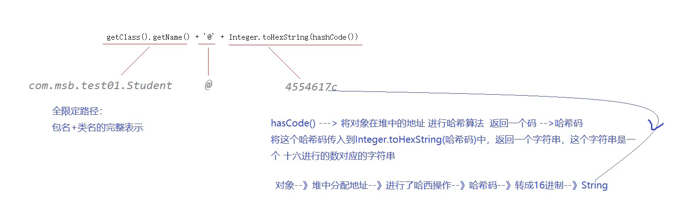

## 8. 面向对象

### 8.1 this指向

this可以修饰构造器：
总结：同一个类中的构造器可以相互用this调用，注意this修饰的构造器必须放在第一行

```java
public class Person {
	int age;
	String name;
	public Person(int age,String name,double height) {
		this(age,name);
		this.height = height;
	}
	
	public Person(int age,String name) {
		this(age);
		this.name = name;
	}
	
	public Person(int age) {
		this.age = age;
	}
}
```

### equals和==区别

1. equals方法对于字符串来说是比较内容的(String类中重新定义了equals这个方法，而且比较的是值，而不是地址)，而对于非字符串来说是比较其指向的对象是否相同的。
2. == 比较符也是比较指向的对象是否相同的也就是对象在对内存中的的首地址
3. 对于非字符串变量来说，"=="和"equals"方法的作用是相同的都是用来比较对象在堆内存的首地址，即用来比较两个引用变量是否指向同一个对象。

具体来说：

*  如果是基本类型比较，那么只能用==来比较，不能用equals 

```java
public class TestEquals { 
	public static void main(String[] args){ 
        int a = 3; 
        int b = 4; 
        int c = 3; 
        System.out.println(a == b);//结果是false 
        System.out.println(a == c);//结果是true 
        System.out.println(a.equals(c));//错误，编译不能通过，equals方法 
        //不能运用与基本类型的比较 
	} 
}
```

* 对于基本类型的包装类型，比如Boolean、Character、Byte、Shot、Integer、Long、Float、Double等的引用变量，==是比较地址的，而equals是比较内容的

```java
public class TestEquals { 
    public static void main(String[] args){ 
        Integer n1 = new Integer(30); 
        Integer n2 = new Integer(30); 
        Integer n3 = new Integer(31); 
        System.out.println(n1 == n2);
        //结果是false 两个不同的Integer对象，故其地址不同， 
        System.out.println(n1 == n3);
        //那么不管是new Integer(30)还是new Integer(31) 结果都显示false 
        System.out.println(n1.equals(n2));
        //结果是true 根据jdk文档中的说明，n1与n2指向的对象中的内容是相等的，都是30，故equals比较后结果是true 
        System.out.println(n1.equals(n3));
        //结果是false 因对象内容不一样，一个是30一个是31 
    } 
} 
```

*  注意：对于String(字符串)、StringBuffer(线程安全的可变字符序列)、StringBuilder(可变字符序列)这三个类作进一步的说明。 

```java
class Value { 
	int i; 
} 
public class EqualsMethod2 { 
	public static void main(String[] args) { 
        Value v1 = new Value(); 
        Value v2 = new Value(); 
        v1.i = v2.i = 100; 
        System.out.println(v1.equals(v2));//（1）flase 
        System.out.println(v1 == v2);//（2）true 
    } 
} 
```

### 8.2 三大特性

#### 8.2.1 封装（Encapsulation）

#### 8.2.2 继承（inheritance）

##### a. 权限修饰符

| 作用域    |       当前类       |       同一包       | 其他包的子孙类     | 其他包的类         |
| --------- | :----------------: | :----------------: | ------------------ | ------------------ |
| public    | :white_check_mark: | :white_check_mark: | :white_check_mark: | :white_check_mark: |
| protected | :white_check_mark: | :white_check_mark: | :white_check_mark: |                    |
| friendly  | :white_check_mark: | :white_check_mark: |                    |                    |
| private   | :white_check_mark: |                    |                    |                    |

##### b. super

[3] super修饰构造器：

* 其实我们平时写空构造器的第一行都有super( )  ----> 作用：调用父类空构造器，只是我们一般省略不写(__所有构造器的第一行默认情况下都有super()，但是一旦你的构造器中显式地使用super调用了父类构造器，那么这个super()就不会给你默认。如果构造器中没有显式地调用父类构造器的话，那么第一行都有super();可以省略不写__)

```java
public class Student extends Person{
	double score;
	public Student(){
		/* super() */
	}
}
```

---

* 如果构造器中已经显示的调用父类super父类构造器，那么它的第一行就没有默认分配的super( )了

```java
public Student(int age,String name,double score){
	super(age,name); // 利用super调用父类构造器
	this.score = score;
}

```

---

* 在构造器中，super调用父类构造器和this调用子类构造器只能存在一个，两者不能共存：因为super修饰构造器要放在第一行

```java
public Student(int age,String name,double score){
	super(age,name); // 利用super调用父类构造器
	this(score);
}

```

==改正如下：==

```java
public Student(int age,String name,double score){
	super(age,name); // 利用super调用父类构造器
	this.score = score;
}

```

[4] IDEA快捷键：alt+insert

##### c. Object类

[1] toString( )


[2] equals( )

equals作用：这个方法提供对对象的内容是否相等的一个比较方式，对象内容指的就是属性
_父类Object提供的equals方法就是在比较==地址，没有实际意义，我们一般不会直接使用父类提供的方法，而是在子类中对这个方法进行重写。_

#### 8.2.3 多态（polymorphism）

(1) 先有父类，再有子类 ---> 继承   先有子类，再有父类 ---> 泛化

(2) 什么是多态：
多态就是多种状态：同一种行为，不同的子类表现出来的不同的形态
多态指的是同一种方法调用，然后由于对象不同会产生不同的行为

(3) 多态的好处：
为了提高代码的扩展性，符合面向对象的设计原则：开闭原则
开闭原则：指的就是扩展是 开放的 修改时关闭的

(4) 多态的要素：
一、继承：Cat extends Animal
二、重写：子类对父类的方法shout( )重写
三、父类引用指向子类的对象

### 8.3 接口

#### jdk1.8以后接口的新增内容

在jdk1.8之前，接口只有两部分内容：
（1）常量：固定修饰符：public static final
（2）抽象方法：固定修饰符：public abstract

在jdk1.8之后，新增非抽象方法：
（1）被public default修饰的非抽象方法
注意1：default修饰符必须要加上，否则出错
注意2：实现类中要是想重写接口中的非抽象方法，那么default修饰符必须不能加，否则出错

（2）静态方法：
注意1：static不可以省略不写
注意2：静态方法不能重写

疑问：为什么要在接口中加入非抽象方法？？
如果接口中只能定义抽象方法的话，那么我要是修改接口中的内容，那么对于实现类影响太大了，所有实现类都会受影响。
现在在接口中加入非抽象方法，对实现类没有影响，想调用就去调用即可